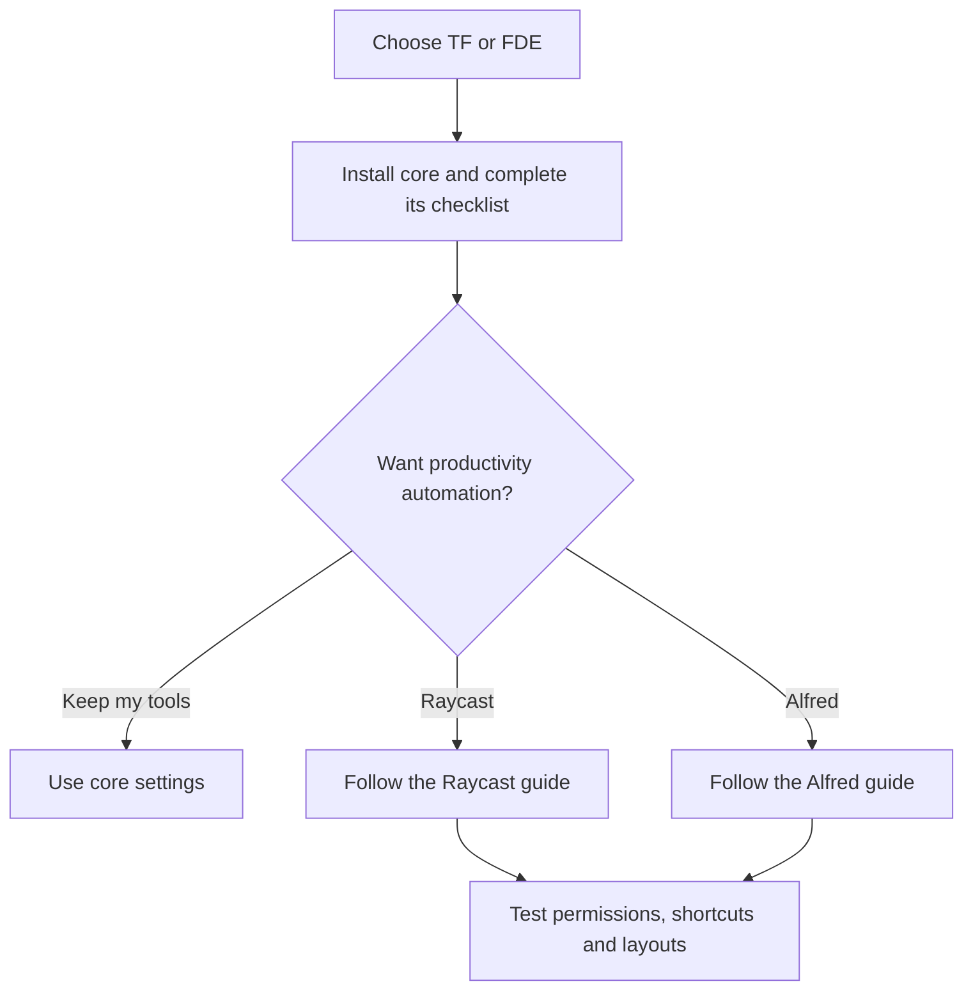

# Start here

Set up your Mac, add productivity tools when you need them, and find the right
shortcuts for your chosen setup.

## Find what you need

| I want to… | Open |
| --- | --- |
| Choose and install TF or FDE | [Choose your macOS profile](setup-profiles.md) |
| Install individual apps and Stow modules myself | [Manual setup](guides/setup.md) |
| Set up Raycast Workmode | [Raycast guide](guides/raycast.md) |
| Set up Alfred, Karabiner and Rectangle Pro | [Alfred guide](guides/alfred.md) |
| Find Raycast aliases and hotkeys | [Raycast reference](modules/raycast-hotkeys.md) |
| Find Alfred TF commands and hotkeys | [TF reference](modules/alfred-tf-hotkeys.md) |
| Find Alfred FDE commands and hotkeys | [FDE reference](modules/alfred-fde-hotkeys.md) |
| Change one tool's configuration | [Module documentation](modules/) |
| Understand an implementation decision | [Architecture decisions](adr/) |

## Set up a new Mac

Core installation does not enable productivity automation. **`--productivity`
selects Alfred + Karabiner + Rectangle Pro.** Raycast has a separate installer
and shared modes for both profiles.

## Finish setup or fix a problem

| Setup | Manual checklist | Troubleshooting |
| --- | --- | --- |
| TF core | [TF checklist](guides/profiles/tf.md#finish-setup-human-checklist) | [TF checks](guides/profiles/tf.md#verification-and-troubleshooting) |
| FDE core | [FDE checklist](guides/profiles/fde.md#finish-setup-human-checklist) | [FDE checks](guides/profiles/fde.md#verification-and-troubleshooting) |
| Raycast | [Set up each Mac](guides/raycast.md#set-up-each-mac) | [Fix a problem](guides/raycast.md#fix-a-problem) |
| Alfred | [Complete setup](guides/alfred.md#complete-setup-on-each-mac) | [Check your setup](guides/alfred.md#check-your-setup) |

## Where documentation lives

| Location | Contents |
| --- | --- |
| [Setup profiles](setup-profiles.md) | Profile choices and installation entry point. |
| [Guides](guides/) | Instructions for installing and using a setup. |
| [Profile guides](guides/profiles/) | FDE and TF installation details and checklists. |
| [Modules](modules/) | Configuration details and hotkey references. |
| [Architecture decisions](adr/) | Decisions and their trade-offs. |
| [Catalogs](../scripts/catalogs/) | JSON data used by generators and checks. |

For building or installing the extension from source, see the
[Workmode developer guide](../extensions/raycast-workstation/README.md).
