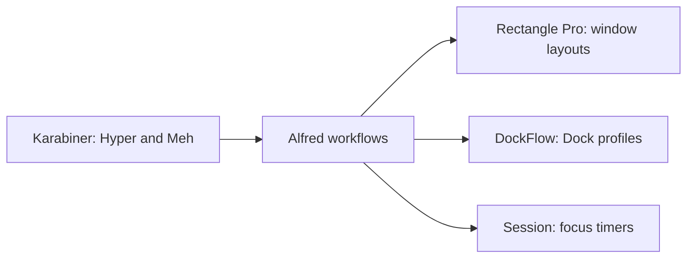

# Set up Alfred, Karabiner and Rectangle Pro

[Start here](../README.md) · [Choose a profile](../setup-profiles.md)

Choose this optional setup if you prefer Alfred workflows with separate keyboard
and window tools. It supports both FDE and TF. For the shared Raycast setup,
use the [Raycast guide](raycast.md) instead. Compare all choices in
[Start here](../setup-profiles.md).

## What each app does

| App | Purpose |
| --- | --- |
| Alfred with Powerpack | Launch apps and run focus, layout and utility workflows. |
| Karabiner-Elements | Map Caps Lock to Hyper and Right Option to Meh using the Hyperland profile. |
| Rectangle Pro | Arrange windows using the imported profile layouts. |
| DockFlow | Switch saved Dock profiles. |
| Session | Run focus and Pomodoro timers. |
| CleanShot X | Handle capture shortcuts and workflow capture actions. |



## Install

First [choose FDE or TF and install the core](../setup-profiles.md). From the checkout,
preview the optional setup, apply it, then check it. Replace `tf` with `fde`
for FDE.

```sh
bash scripts/setup-workstation.sh plan --profile tf --productivity
bash scripts/setup-workstation.sh apply --profile tf --productivity
bash scripts/setup-workstation.sh check --profile tf --productivity
```

Alternatively, run `bash install.sh --profile tf --productivity` or use the
matching `setup/TF-Productivity.command` or `setup/FDE-Productivity.command`
launcher. Keep the backup path and rollback command printed during setup.

Repeat `--productivity` whenever you want to manage this automation. Omitting it
leaves existing productivity settings untouched; it does not uninstall them.

## Complete setup on each Mac

| Step | What to do |
| --- | --- |
| 1. Install Karabiner | Download the official DMG from [Karabiner-Elements](https://karabiner-elements.pqrs.org/), mount it and run its PKG installer. Complete its macOS service and input-access prompts, then choose **Hyperland**. This setup does not install Karabiner through Homebrew. |
| 2. Connect Alfred | Activate Powerpack. Set **Advanced → Set preferences folder** to `~/.config/alfred`, restart Alfred, then rerun apply with `--productivity`. This setup assigns **Command+Space** to Alfred; disable the overlapping Spotlight shortcut. |
| 3. Import Rectangle settings | Activate Rectangle Pro and grant Accessibility. Import `~/.config/rectangle-pro/RectangleProConfig.json` through **App Settings → Import Config**. Repeat after changing profiles. |
| 4. Prepare DockFlow | Import the selected profile's Dock preset pack using the instructions below. Resolve duplicate names. Disable preset actions that open or quit apps, so Alfred controls focus switching. |
| 5. Prepare Session | Install the focus timer from [Session](https://www.stayinsession.com/) or Setapp and enable Pro URL automation. The Homebrew `session` cask is an unrelated messenger. Create the categories listed below. |
| 6. Assign desktops | Create four ordinary desktops and turn off automatic Space reordering. Assign apps using the selected profile guide. These assignments are local to each Mac. |
| 7. Finish utilities | Configure CleanShot X capture shortcuts, install the Alfred Gallery utilities you use, and enable the required apps at login. Complete licenses, sign-ins and permissions directly. |

If migrating from Raycast, disable competing Raycast launcher and Hyper bindings
before testing this setup. Each automation setup needs its own shortcut map and
Space assignments.

## Follow your profile

| Reference | TF | FDE |
| --- | --- | --- |
| App setup and utilities | [TF app setup](profiles/tf.md#complete-the-apps-on-each-mac) | [FDE app setup](profiles/fde.md#complete-the-apps-on-each-mac) |
| Session categories | [Work, Code, Innovate](profiles/tf.md#session-categories--human-setup) | [Work and Code](profiles/fde.md#session-categories--human-setup) |
| DockFlow preset import and export | [TF DockFlow](profiles/tf.md#import-and-export-dockflow) | [FDE DockFlow](profiles/fde.md#import-and-export-dockflow) |
| Desktop assignments | [TF desktops](profiles/tf.md#four-desktops-and-working-spaces) | [FDE desktops](profiles/fde.md#four-desktops-and-working-spaces) |
| Commands and hotkeys | [TF reference](../modules/alfred-tf-hotkeys.md) | [FDE reference](../modules/alfred-fde-hotkeys.md) |

## Check your setup

1. Run the profile check command with `--productivity` and resolve reported issues.
2. Hold Caps Lock and press F: Finder should open. Tap Caps Lock: Escape should be sent.
3. Hold Right Option and press Return: Alfred's layout menu should appear.
4. Run `wl work`: verify the Dock and window positions. Other apps should stay open.
5. Save your work, then run `fs work`: verify that the intended apps remain open and Session shows a 30-minute timer in **Work**.
6. Log out and back in, then repeat the physical shortcut and layout checks.

A successful configuration check does not confirm macOS permissions, native
imports or live window movement.

## Update or undo

After pulling reviewed updates, rerun plan, apply and check with your profile and
`--productivity`. Reimport Rectangle and DockFlow settings when the profile changes.

To undo a managed setup, use its printed backup path:

```sh
bash scripts/setup-workstation.sh rollback BACKUP_DIRECTORY
```

Rollback restores managed configuration and links. Installed apps, accounts and
licenses remain. Restore native Rectangle and DockFlow imports from your own
backups. See the [TF](profiles/tf.md#updates-profile-switching-and-rollback) or
[FDE](profiles/fde.md#updates-profile-switching-and-rollback) rollback details.
