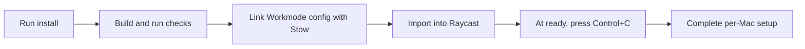
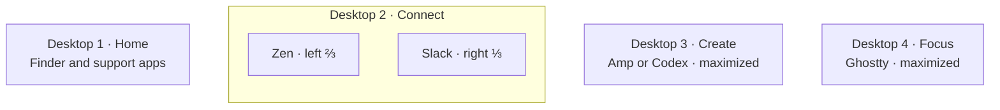
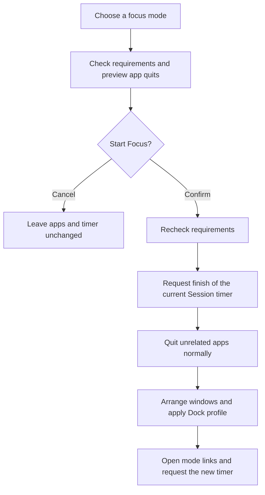

# Set up Raycast Workmode

[Start here](../README.md) · [Choose a profile](../setup-profiles.md)

Workmode lets you arrange apps, switch your Dock and start a focus timer from
Raycast. It is an **optional macOS setup** for both FDE and TF. Core dotfiles
installation does not enable it.

[Install](#install) · [Set up each Mac](#set-up-each-mac) · [Modes](#choose-a-mode) ·
[Shortcuts](../modules/raycast-hotkeys.md) · [Troubleshooting](#fix-a-problem)

## Choose the action you need

| Action | Arranges apps and changes Dock | Quits unrelated apps | Changes the timer |
| --- | --- | --- | --- |
| Window Layout (`wl`) | Yes | No | No |
| Focus Session (`fs`) | Yes | Yes, after your confirmation | Finishes the old timer; requests a new one |
| DockFlow Profile (`df`) | Dock only | No | No |
| Session Timer (`ss`) | No | No | Requests a standalone timer |

**Focus sessions close apps.** Save your work before starting one. Normal save
prompts are respected; a cancelled or timed-out quit stops the switch. Finder,
Raycast, DockFlow and Session remain available. Codex stays open only when the
chosen mode includes it.

## Install

Install these prerequisites first. The Workmode installer does not install or
license apps, grant permissions, or change login settings.

| Requirement | What to do |
| --- | --- |
| macOS | Use this setup on a Mac. The installer rejects other operating systems. |
| Node 22.18+ and npm | Run `brew install node`. |
| GNU Stow | Run `brew install stow`. |
| Xcode Command Line Tools | Run `xcode-select --install` if they are missing. |
| Raycast | Run `brew install --cask raycast`. Sign in directly; layouts and focus need Pro window-management access. |
| DockFlow | Install and activate it for saved Dock profiles. |
| Session | Install the focus timer from [Session](https://www.stayinsession.com/) or Setapp. Enable its URL automation. The Homebrew `session` cask is an unrelated messenger. |
| Mode apps | Install the apps for the [modes you use](#choose-a-mode), and complete their first-run setup. |
| CleanShot X | Needed only for the capture menu. |

From the dotfiles checkout, run:

```sh
bash scripts/setup-raycast-workstation.sh install
```

Or double-click `setup/Raycast.command`. After **Importing Workmode**, wait for
**ready**, then press **Control+C**. Workmode stays installed; you do not need a
terminal or development watcher running at login.



A Stow conflict stops installation instead of replacing your files. Resolve the
conflict, then retry. If import fails, the configuration may already be linked;
rerunning `install` is safe. See [Raycast's local installation guide](https://developers.raycast.com/basics/create-your-first-extension).

## Set up each Mac

| Step | What to do | How to check |
| --- | --- | --- |
| 1. Create four desktops | In Mission Control, add four ordinary desktops. Turn off automatic Space reordering. | You can select Desktop 1–4. |
| 2. Assign their roles | On Desktop 1, open **Check Workmode Setup** and choose **Assign This Space to Desktop 1**. Repeat while on each other desktop. | All four roles show Ready. Do not assign every role from the same Space. |
| 3. Prepare DockFlow | Create or import one preset for each mode you use, with the exact name in the table below. Turn off preset actions that also open or quit apps. | The setup checker finds exactly one matching preset. |
| 4. Add Session categories | Create the category names in the mode table. In Session, type `@` in the intention field to find category controls. Reuse existing names. | Check the category on your first timer and in Session history. |
| 5. Choose timer handoff | For automatic switching, turn off **Settings → General → Ask for Reflection when Session has ended** in Session. If you keep it on, submit reflection before starting the next timer with `ss`. | Start requests sent during reflection can be ignored; the installer does not change this preference. |
| 6. Configure shortcuts | Set Raycast to **Option+Space**, keep Spotlight on **Command+Space**, and follow the [shortcut reference](../modules/raycast-hotkeys.md). | Test the actual keys; Stow does not register native aliases or hotkeys. |
| 7. Set startup and permissions | Enable Raycast and the support apps you need at login. Complete macOS access prompts directly. Use CleanShot X for capture shortcuts. | Test again after logging in. |
| 8. Choose browser context | Select the intended Zen workspace or profile yourself. Work uses Edge. | Workmode does not switch browser identities or Zen workspaces. |

If migrating from Alfred, Karabiner or Rectangle Pro, disable their competing
shortcuts and login items after testing Raycast. They are not Workmode dependencies.
For several displays, focus a normal app on the intended display before assigning
its Space. Repeat assignments after recreating desktops or changing displays.

DockFlow preset contents stay in DockFlow. Export them through its UI and review
personal paths before sharing. Do not replace your current presets with an older
pack just because it is in dotfiles.

## Choose a mode

A dash means Workmode does not arrange a window on that desktop. Apps listed
without a fraction are maximized. Video also maximizes Finder on Desktop 1.

| Mode | DockFlow preset | Desktop 2 · Connect | Desktop 3 · Create | Desktop 4 · Focus | Minutes / Session category |
| --- | --- | --- | --- | --- | --- |
| Default | `0. Default` | Zen | — | — | No timer |
| Work | `1. Work` | Edge ⅔ + Teams ⅓ | Claude | — | 30 / Work |
| Code | `2. Code` | Zen ⅔ + Slack ⅓ | Amp | Ghostty | 45 / Code |
| Author | `3. Author` | Zen | Claude | Obsidian | 45 / Author |
| Design | `4. Design` | Zen + Excalidraw link | Figma | Affinity | 45 / Design |
| Innovate | `5. Innovate` | Zen ⅔ + Slack ⅓ | Codex | Ghostty | 45 / Innovate |
| Video | `6. Video` | — | Final Cut Pro | Motion | 45 / Video |
| Zen | `9. Zen` | Zen | — | Obsidian | 25 / Zen |

Code and Innovate use this arrangement:



These are **tiled or maximized windows on ordinary desktops**, not native
fullscreen or Split View. On a narrow display, Slack may need more than one
third; Workmode adjusts Zen to fit beside it. It does not create your desktops.

Use `wco` for the Code layout or `fco` for Code focus. Use `win` or `fin` for the
Codex alternative. Direct aliases open the selected mode; they do not start it
until you choose its action. See [all mode aliases](../modules/raycast-hotkeys.md#direct-layouts-and-focus-sessions).

## Start and switch focus sessions



A failed requirements check leaves the old timer alone. A later failure can leave
it finished, with no new timer started. Always check Session's visible timer:
a successful URL request does not prove that Session accepted it.

For a timer without app changes, run `ss` and choose **20, 25, 30, 45 or 60 minutes**.
It uses Session's current/default category unless you choose a category action.
The 20- and 25-minute choices use the intention **Pomodoro**. Session categories
must exist first; Workmode cannot create them. A timer alone does not keep the
Mac awake; use your separate keep-awake control if needed.

## Fix a problem

| Problem | What to do |
| --- | --- |
| Workmode is missing from Raycast | Run `install` again. Wait for the import's ready message. Search by command name if aliases are not set. |
| A mode says Setup needed | Run **Check Workmode Setup** (`wchk`). Resolve the named app, DockFlow preset or desktop assignment. |
| “This desktop is already assigned to role …” | Check which physical Space that role uses. Reassign the mistaken role from its intended Space, then retry. |
| “Cannot get window” | Open the app's main window, finish first-run dialogs, exit native fullscreen and retry. Zen still has an intermittent cold-launch resize error. Do not reset all desktop assignments for this error. |
| A window “did not settle” | Check its target desktop, minimum size and fullscreen state. Workmode verifies bounds after moving; it stops if the result is wrong. |
| “A mode switch is already running” | Let the switch or save prompt finish. After a crash, wait at least 60 seconds and retry. The current lock recovers automatically; do not delete it during an active switch. |
| The timer did not switch | Complete Session's reflection or other prompt, then request the timer with `ss`. Check step 5 above before relying on automatic handoff. |
| Move to Previous Space does nothing | Its last audited assignment was incomplete and disabled. Follow the [physical recording steps](../modules/raycast-hotkeys.md#finish-space-shortcuts). |
| A shortcut runs the wrong action | Check for a duplicate binding in Raycast, Codex or a legacy launcher/remapper. |

## Update, check or remove

Run these from the dotfiles checkout:

| Goal | Command | Result |
| --- | --- | --- |
| Preview setup | `bash scripts/setup-raycast-workstation.sh plan` | Describes the steps; changes nothing. |
| Build only | `bash scripts/setup-raycast-workstation.sh build` | Compiles and validates; no Stow or import. |
| Install or update | `bash scripts/setup-raycast-workstation.sh install` | Builds, links and imports. Repeat after pulling source changes. |
| Check local setup | `bash scripts/setup-raycast-workstation.sh check` | Checks source and the Stow link; use `wchk` for live prerequisites. |
| Unlink configuration | `bash scripts/setup-raycast-workstation.sh rollback` | Removes the Stow link only. |

**To stop using Workmode, also remove it in Raycast Settings.** Unlinking alone
leaves the installed extension able to use its bundled defaults. App data and
private Raycast settings remain. The older `apply` command only builds and links;
use `install` when you also need import.

| Saved in dotfiles | Kept on each Mac or in the app |
| --- | --- |
| Mode definitions, shortcut reference, extension source and icons | Desktop IDs, app credentials, licenses, browser profiles, Session categories and DockFlow data |
| Reviewed `~/.config/raycast-workstation` files, linked by Stow | Raycast databases, native settings and private `.rayconfig` exports |

Use Raycast's supported sync or private backup flow for native settings. Keep
exports outside Git. Import Workmode source separately on each Mac.

## What has been verified

These are recorded results from **13 September 2026**, not a promise that every
mode works in every window state.

| Check | Result and limit |
| --- | --- |
| macOS build and install | Passed locally and in CI; commands remain after stopping the watcher. |
| Layout menus and aliases | Eight layouts and seven focus sessions load; Code uses Amp and Innovate uses Codex. |
| Default, Work, Author, Design and Zen layouts | Passed recorded window/Dock tests. Later Zen cold launches still showed intermittent errors. |
| Zen + Slack sizing | Passed an isolated test with Slack's minimum-width adjustment. |
| Full Code and Innovate focus sessions | Still need a user test; computer-use access to Ghostty was unavailable. |
| Video | Not live-tested; the media apps were not installed on the test Mac. |
| Timer handoff and Space hotkeys | Need the manual checks described above. |

## Keep extensions useful

Use native Raycast commands for single actions. Keep Workmode for coordinated
modes, DockFlow for Dock contents, Session for timers, and CleanShot X for capture.

Before removing a Store extension, check whether you use a feature that its
replacement lacks. Common overlaps include Pomodoro versus Session, Emoji Search
versus native symbols, and multiple app cleaners. Installation count alone does
not measure performance. No extension is removed by this setup.

[Developer guide](../../extensions/raycast-workstation/README.md) ·
[Design decision](../adr/0005-workmode-local-install.md) ·
[Raycast Hyper](https://manual.raycast.com/hyper-key) ·
[Raycast window management](https://manual.raycast.com/window-management) ·
[Session URL actions](https://www.stayinsession.com/learn/session-url-scheme)
