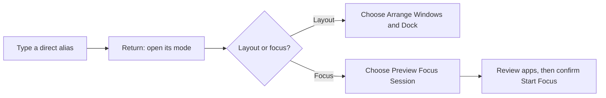

# Raycast shortcuts

Open Raycast with **Option+Space**, type an alias, then press **Return**.
Spotlight keeps **Command+Space**.

This is the shared shortcut map. **Set aliases and hotkeys in Raycast Settings**
or restore them through Raycast's supported sync. Stow only links the reference
files; it does not record native shortcuts. Test each binding on each Mac.

[Setup guide](../guides/raycast.md) · [Modes](#direct-layouts-and-focus-sessions) ·
[Apps](#apps) · [Windows](#windows) · [Space shortcut setup](#finish-space-shortcuts)

## Know the modifier keys

| Key or chord | Use |
| --- | --- |
| Hyper | Hold Caps Lock after enabling Raycast's native Hyper with **Include Shift**. It sends Command+Control+Option+Shift. A quick tap sends Escape. |
| Meh | Hold **Control+Option+Shift** together. Right Option is not a separate Meh key; Right Command also stays normal. |
| Control+Option | Window size and position. |
| Command | Keep normal macOS app commands, such as copy, paste, close and quit. |

Hyper already includes Shift. **Hyper+Shift is not another shortcut layer.**
Double-tap bindings were explored but are not part of this installed map.

## Menus and utilities

| Alias | Command | Shared hotkey |
| --- | --- | --- |
| `hk` | Workmode: modes and actions | Hyper+Space |
| `wl` | Window Layout | Meh+Return |
| `fs` | Focus Session | Meh+F |
| `df` | DockFlow Profile | — |
| `ss` | Session Timer | — |
| `wchk` | Check Workmode Setup | — |
| `cs` | CleanShot X capture menu | Meh+C |
| `gw` | Google Workspace links in Zen | — |
| `clip` | Clipboard History | Meh+V |
| `snip` | Search Snippets | Meh+S |
| `file` | Search Files | — |
| `emo` | Search Emoji & Symbols | — |

Use CleanShot X for your capture shortcuts, including Command+Shift+3/4/5 where
configured. The `cs` menu also offers recording, scrolling capture, OCR and history.

## Direct layouts and focus sessions

| Mode | Layout | Focus | Dock only | Dock hotkey |
| --- | --- | --- | --- | --- |
| Default | `wff` | — | `dff` | Meh+0 |
| Work | `wwo` | `fwo` | `dwo` | Meh+1 |
| Code | `wco` | `fco` | `dco` | Meh+2 |
| Author | `wau` | `fau` | `dau` | Meh+3 |
| Design | `wde` | `fde` | `dde` | Meh+4 |
| Innovate | `win` | `fin` | `din` | Meh+5 |
| Video | `wvi` | `fvi` | `dvi` | Meh+6 |
| Zen | `wze` | `fze` | `dze` | Meh+9 |

**Code uses Amp; Innovate uses Codex.** Both include Zen, Ghostty and Slack.
The mode table in the [setup guide](../guides/raycast.md#choose-a-mode) lists
all apps, desktops, Dock names and timer categories.

The `d…` aliases apply the Dock preset immediately. They do not arrange apps,
quit apps or change a timer. The `w…` layout commands leave other apps open.
Focus uses normal quits after confirmation.

Old aliases `ddefault`, `dwork`, `dcode` and `wcheck` are replaced by `dff`, `dwo`,
`dco` and `wchk`. `famp` and `ft3` are retired. Use `fco` for Amp; T3 is a
launcher-only option.

## Apps

Assign these to native **Applications** entries in Raycast, not custom launch
commands. An app must be installed before its alias or hotkey can work.

| App | Alias | Hyper + |
| --- | --- | --- |
| Zen Browser | `zen` | D |
| Ghostty | `gt` | H |
| Finder | `ff` | F |
| ChatGPT / Codex | `cx` | J |
| Cursor | `cu` | K |
| Claude | `cl` | L |
| Amp | `amp` | A |
| Obsidian | `ob` | N |
| Microsoft Edge | `edge` | E |
| Microsoft Teams | `tm` | I |
| Slack | `sl` | S |
| Microsoft Word | `wd` | W |
| Microsoft Excel | `xl` | O |
| Microsoft PowerPoint | `ppt` | P |
| Final Cut Pro | `fcp` | Z |
| Motion | `mot` | X |
| Compressor | `comp` | C |
| Telegram | `tg` | T |
| T3 Code | `t3` | G |
| Figma | `fg` | R |
| Affinity | `af` | U |

Final Cut Pro, Motion, Compressor, Telegram and T3 were not installed on the last
test Mac; their keys are reserved. T3 and Telegram are not in layouts or focus
sessions. App launch shortcuts do not switch browser profiles.

These **Codex app bindings** are reserved; do not assign them globally in Raycast:

| Hyper + | Codex action |
| --- | --- |
| B | Toggle the pet |
| V | Voice chat |
| M | Dictation |

## Windows

Hold **Control+Option** with the key below. Focus the window you want to change.
These are native Raycast commands; they do not launch Workmode.

| Key | Command | Alias |
| --- | --- | --- |
| Return | Maximize | `wmax` |
| Forward Delete | Restore | `wrst` |
| ← | Left Half | `wlh` |
| → | Right Half | `wrh` |
| ↑ | Top Half | `wth` |
| ↓ | Bottom Half | `wbh` |
| D | First Third | `w13l` |
| F | Center Third | `w13c` |
| G | Last Third | `w13r` |
| E | First Two Thirds | `w23l` |
| T | Last Two Thirds | `w23r` |
| Comma | Move to Previous Space | `wsp` |
| Period | Move to Next Space | `wsn` |
| Minus | Make Smaller | `wsm` |
| Equals | Make Larger | `wlg` |

For Restore on a compact keyboard, the last audited binding used
**Fn+Backspace** for Forward Delete. Confirm the recorded key in Raycast.

| Arrange two windows | First window | Second window |
| --- | --- | --- |
| Left ⅔ + right ⅓ | Control+Option+E | Control+Option+G |
| Left ⅓ + right ⅔ | Control+Option+D | Control+Option+T |

**Move to Previous/Next Space moves the window.** Native Control+Left/Right
switches the desktop you are viewing. Physical display movement is separate:
the last audit found Control+Option+Command+Left/Right; verify it with a second
monitor connected.

## Finish Space shortcuts

The last live audit found **Move to Previous Space disabled** with an incomplete
hotkey. Comma/period are the target bindings, not verified working shortcuts.
Computer-controlled recording captured only modifiers; this does not establish
a Raycast limitation. Record the shortcuts using your keyboard:

1. In Raycast Settings, find **Move to Previous Space**.
2. Clear its incomplete hotkey. Record **Control+Option+comma** and confirm the
   comma is shown before enabling the command.
3. Record **Control+Option+period** for **Move to Next Space**.
4. Use a disposable Finder window on Desktop 2. Move it to Desktop 1 and back,
   then to Desktop 3 and back. Confirm the window moved, not just your view.
5. Test fractions, maximize and restore. Check for competing Rectangle or
   Karabiner bindings, then repeat after login.

## Use the same map on another Mac

| Reference file | Purpose |
| --- | --- |
| [`aliases.json`](../../raycast/.config/raycast-workstation/aliases.json) | Exact alias names and command IDs |
| [`hotkeys.json`](../../raycast/.config/raycast-workstation/hotkeys.json) | Modifier layers, keys and owners |

These JSON files are references, **not Raycast import files**. Use Cloud Sync
for your own devices where supported, or enter them in Raycast Settings. Import
Workmode source on each Mac and check optional apps before assigning their keys.

[Raycast hotkeys](https://manual.raycast.com/command-aliases-and-hotkeys) ·
[Native Hyper](https://manual.raycast.com/hyper-key) ·
[Window management](https://manual.raycast.com/window-management)
