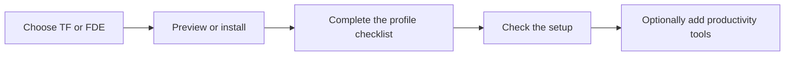

# Choose your macOS profile

[Start here](README.md)

Choose **TF** for the smaller app selection or **FDE** for the wider developer
setup. Both support Apple Silicon Macs and install the shared command-line tools,
Zen Browser, Ghostty, Claude Desktop, Cursor and ChatGPT/Codex.

## Choose a profile

| Profile | Best fit | What differs | Guide |
| --- | --- | --- | --- |
| **TF — Tech Founder** | Building and prototyping with Cursor and Codex. | Smaller app selection; no T3 Code installation. | [TF setup](guides/profiles/tf.md) |
| **FDE — Full developer environment** | Development with a wider choice of coding tools. | Includes T3 Code; broader Alfred workflows if you opt into them. | [FDE setup](guides/profiles/fde.md) |

Amp and Chrome Canary are optional. Profile selection is local to each Mac;
everyone uses the same repository.

## Install your profile

Run this in Terminal as your normal user. Replace `tf` with `fde` for FDE.

```sh
curl -fL https://raw.githubusercontent.com/rahulnakmol/dotfiles4macOS/main/install.sh -o /tmp/dotfiles-install.sh && bash /tmp/dotfiles-install.sh --profile tf
```

Already have a checkout? Run the matching command from it:

| Profile | Install | Preview without changes |
| --- | --- | --- |
| TF | `bash install.sh --profile tf` | `bash install.sh --profile tf --plan` |
| FDE | `bash install.sh --profile fde` | `bash install.sh --profile fde --plan` |

For a double-click setup, download the repository using **Code → Download ZIP**,
extract it and open **`setup/TF.command`** or **`setup/FDE.command`**. From a ZIP,
the launcher clones into `~/.dotfiles`; from a Git checkout, it uses that checkout.

The installer checks prerequisites, installs missing packages, Stows core settings
and opens your profile checklist. Complete any Apple Command Line Tools prompt,
then rerun. Existing checkouts keep their branch and local changes.

## Complete your profile



| Profile | Manual steps | Check core configuration |
| --- | --- | --- |
| TF | [TF checklist](guides/profiles/tf.md#finish-setup-human-checklist) | `bash scripts/setup-workstation.sh check --profile tf` |
| FDE | [FDE checklist](guides/profiles/fde.md#finish-setup-human-checklist) | `bash scripts/setup-workstation.sh check --profile fde` |

The installer returns `0` when managed checks pass, `2` when a human step or check
remains, and `1` for an error. Keep the backup path and rollback command printed
during setup. Passing file checks does not verify personal sign-ins or permissions.

## Optional next steps

Core installation leaves your launcher and window manager unchanged. Add one
productivity setup if you want keyboard automation, layouts and focus sessions.

| Preference | Follow this guide |
| --- | --- |
| Raycast for launching apps and managing windows; shared modes for FDE and TF. Requires Raycast Pro, DockFlow and Session. | [Raycast Workmode](guides/raycast.md) |
| Alfred workflows with Karabiner key remapping and Rectangle Pro layouts; workflows differ by profile. | [Alfred + Karabiner + Rectangle Pro](guides/alfred.md) |

**`--productivity` means the Alfred setup.** Leave it off when choosing Raycast.
The linked guides cover installation, licenses, permissions, shortcuts and
per-Mac checks. If you prefer to select individual Stow modules instead of a
profile, use the separate [manual setup guide](guides/setup.md).
