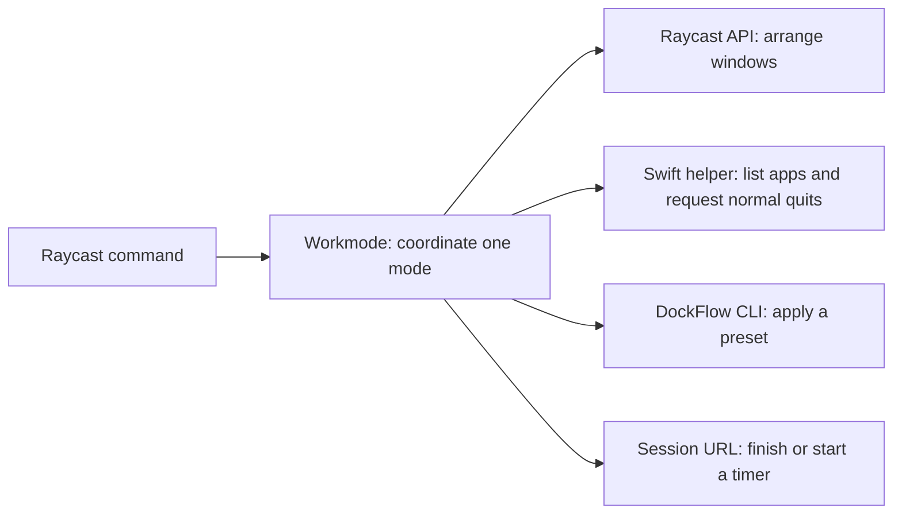

# Workmode

A small macOS Raycast extension by **Rahul N Akmol**. It coordinates named modes
through Raycast window management, DockFlow and Session.

[Setup guide](../../docs/modules/raycast.md) ·
[Shortcut reference](../../docs/hotkeys.md#raycast-focus--layouts) ·
[Design decision](../../docs/adr/0005-workmode-local-install.md)

## Install or update

From the dotfiles checkout:

```sh
bash scripts/setup-raycast-workstation.sh install
```

Or double-click `setup/Raycast.command`. After **Importing Workmode**, wait for
**ready**, then press **Control+C**. The extension remains installed. Repeat
after pulling source updates. Complete the [prerequisites and per-Mac steps](../../docs/modules/raycast.md#install)
before running a layout or focus session.

| Task | Command from the repo root |
| --- | --- |
| Read the plan | `bash scripts/setup-raycast-workstation.sh plan` |
| Build and validate without Stow or import | `bash scripts/setup-raycast-workstation.sh build` |
| Build, Stow and import | `bash scripts/setup-raycast-workstation.sh install` |
| Check source and the Stow link | `bash scripts/setup-raycast-workstation.sh check` |
| Unlink configuration only | `bash scripts/setup-raycast-workstation.sh rollback` |

The old `apply` action still prepares and links only. To disable Workmode, remove
it in Raycast Settings too; an installed extension can use bundled defaults.

## Change the source

| Change | Edit | Then run |
| --- | --- | --- |
| Apps, modes, desktops or durations | `raycast/.config/raycast-workstation/workstation.json` | Regenerate the keymap and run `install`. |
| Alias names or native key map | `scripts/build-raycast-keymap.mjs` | `node scripts/build-raycast-keymap.mjs`, then configure the native settings in Raycast. |
| Command behavior | `extensions/raycast-workstation/src/` | Tests and typecheck, then `npm run dev` from this directory. |
| Running-app helper | `assets/DesktopHelper.swift` | Run `build` or `install` to compile it for this Mac. |

The build copies the canonical configuration into `assets/workstation.json`.
Do not maintain the copy separately. Raycast reads the Stow-linked configuration
when present and otherwise uses bundled defaults. Desktop assignments are local
and override the shared configuration.

## Keep each tool's job small



| Tool | Owns |
| --- | --- |
| Native Raycast | App launching, Hyper, individual window commands, clipboard, snippets and Quicklinks |
| Workmode | Mode requirements, focus preview, app/window order, Dock changes and timer requests |
| DockFlow | Saved Dock apps, folders and order |
| Session | Timer UI, categories and history |
| CleanShot X | Screen capture; Workmode's capture menu only opens its actions |

Keep the direct command files: Raycast attaches each alias/hotkey to a command.
They delegate to shared logic. Capture and Google menus are small URL dispatchers.
Do not add a plugin framework, another timer, or native-feature wrappers without
a concrete workflow that needs them.

| Runtime dependency | Why it exists |
| --- | --- |
| `@raycast/api` | Native UI and window APIs |
| `zod` | Validate config and external data |
| `proper-lockfile` | Prevent overlapping switches and recover after crashes |

Workmode runs on demand. During a switch it reads app/desktop data together,
then moves windows and requests normal quits in order. Polling is bounded;
there is no idle watcher after development stops. The Swift helper emits JSON
for running apps and requests normal quits. It does not force-kill them.

## Validate a change

From this directory:

```sh
npm test
npm run typecheck
npm run build
```

For installer or keymap changes, also run from the repo root:

```sh
node --test scripts/test-raycast-setup.mjs scripts/test-raycast-keymap.mjs
node scripts/build-raycast-keymap.mjs --check
bash -n scripts/setup-raycast-workstation.sh setup/Raycast.command
```

Tests use isolated fixtures; they do not quit your apps. CI builds on macOS
without Stow or import. `npm run build` validates a bundle; `npm run dev` imports
it into Raycast. Follow the [recorded limits and manual checks](../../docs/modules/raycast.md#what-has-been-verified)
for real windows, timers and hotkeys.

## Share the source

Commit source, reviewed config, icons and the lockfile. Keep `node_modules`,
`dist`, generated Raycast types, the compiled helper and private app state out
of Git. Compile the helper again on each Mac.

This is a local source installation, not a Store release. The visible name is
**Workmode**; the internal ID is `workstation`. Preserve that ID and command IDs
to retain aliases and local mappings. Store publication needs a separate review
of onboarding, helper packaging, icons, screenshots, linting and fresh-Mac tests.

[Raycast prerequisites](https://developers.raycast.com/basics/getting-started) ·
[Local installation](https://developers.raycast.com/basics/create-your-first-extension) ·
[Contributing](https://developers.raycast.com/basics/contribute-to-an-extension) ·
[Build and import](https://developers.raycast.com/information/developer-tools/cli)
